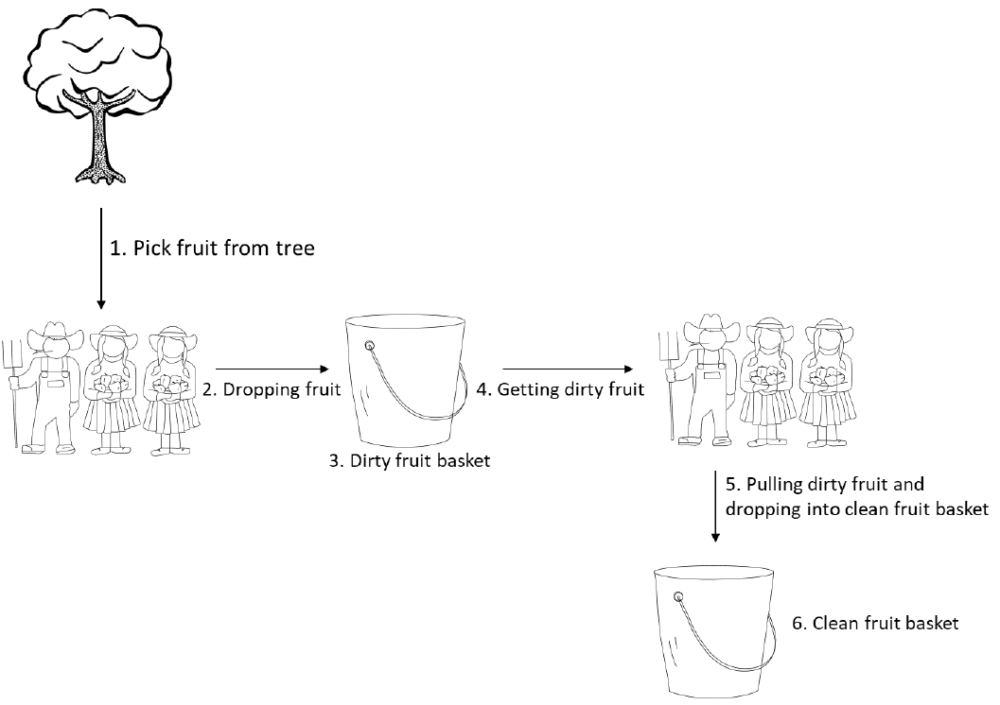

[](https://www.python.org/downloads/release/python-390/)

# Farming Simulator
Executes the farming simulator

This project corresponds to the second coding exercise of Cocus Challenge.

In this exercise we will be testing your multithreading skills.

Suppose that you want to simulate a fruit farm:
* Three farmers are collecting fruits from a single tree to a single dirty fruit basket.
* In parallel, three other farmers are getting the fruits from the dirty fruit basket, cleaning them, and pushing them into the single cleaned fruit basket.
* All the farmers are managing the fruit individually
* The tree has 50 fruits (and only one farmer at one time can pick fruit from the tree)
* Time to collect fruits from the trees into the basket: random(3,6) seconds
* Time to clean the fruits into the cleaned fruit basket: random(2,4) seconds
* The simulation ends when all the fruits from the tree are collected and cleaned.
* The number of fruits in the tree and in the baskets must be logged every second.



# Quick Start

## Install

Clone this respository and run the following command:

```bash
pip install -r requirements.txt
```

## Use

To execute the Farming simulator with the default scenario:

```bash
./farming.py
```

For more details about the syntax, please run:

```
./farming.py --help
```
```
usage: farming.py [-h] [--pickers PICKERS] [--cleaners CLEANERS] [--fruits FRUITS] [--verbose]

Executes the farming simulator

optional arguments:
  -h, --help           show this help message and exit
  --pickers PICKERS    Number of pickers [Default: 3]
  --cleaners CLEANERS  Number of cleaners [Default: 2]
  --fruits FRUITS      Number of fruits in the tree at the beginning [Default: 50]
  --verbose            increase output verbosity

```

## Test

To run all unit tests, please run the following command:

```
python -m unittest
```